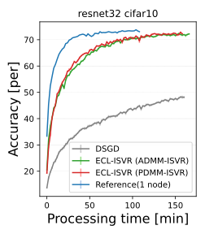

# ecl-isvr

# Goal
Our study __"Edge-Consensus Learning with Implicit Stochastic Variance Reduction (ECL-ISVR)"__ is an effective deep neural network (DNN) optimization algorithm that can use decentralized datasets over an arbitrary network structure. This source code is prepared for following paper validation:

__"Title: "Asynchronous Decentralized Optimization With Implicit Stochastic Variance Reduction"  
Authors: Kenta Niwa (NTT), Guoqiang Zhang (University Technology of Sydney), W. Bastiaan Kleijn (Victoria University of Wellington), Noboru Harada (NTT), Hiroshi Sawada (NTT),  and Akinori Fujino (NTT)
Conference: Proceedings of the 38th International Conference on Machine Learning 2021 (ICML 2021)
"__

Our poster material that is used in our ICML's presentation is shown for brief paper explanation. 

# 

Main contribution of this paper is that an optimal condition where primal-dual formalism (e.g., ECL) matches famous SVR (See above paper) is clearly shown. Our method is robust to further practical situations where the data are statistically heterogeneous across the nodes and/or where communication is asynchronous. 

To verify the effectiveness of our method, we prepared a sample code that runs on GPU/GPUs machines. ECL-ISVR is composed of two flavors, namely (i) PDMM-ISVR and (ii) ADMM-ISVR. Note that the source code written in PyTorch is organized by [Masahiko Hashimoto](https://github.com/hashimom), Tomonori Tada, and Kenta Niwa. 

# License
Carefully read the license file before installing our software. The following paper must be cited when publishing an article that adopts or improves our software:


__"Title: "Asynchronous Decentralized Optimization With Implicit Stochastic Variance Reduction"  
Authors: Kenta Niwa (NTT), Guoqiang Zhang (University Technology of Sydney), W. Bastiaan Kleijn (Victoria University of Wellington), Noboru Harada (NTT), Hiroshi Sawada (NTT),  and Akinori Fujino (NTT)
Conference: Proceedings of the 38th International Conference on Machine Learning 2021 (ICML 2021)
"__

After checking the license file, start the installation by following the guide.

## Setup Environment
### On Linux
```shell script
pip install -r requirements.txt
```

### On Windows  
On Windows, first install PyTorch using the following pages as a guide:
https://pytorch.org/

After that, the procedure is identical as for Linux.
```commandline
pip install -r requirements.txt
```

## Setup files
Modify the following configuration files before running:

* Node list file
* Host config file

### 1. Node list file
The node list file contains the network information (address and port number) of the nodes and the nodes to be connected.

Under **"nodes"**, include the information for each node as follows:

Refer to **node_list.json** as a sample.  

| key    | value                                    |
| ------ | ---------------------------------------- |
| name   | Unique node name                         |
| device | Device used. e.g., "cuda"                |
| round  | Interval to swap variables between nodes |
| edges  | (list) Connected nodes                   |

### 2. Host config file
The node config file contains the required parameters and the devices used in learning.

Refer to **hosts.json** as a sample.  

| key  | value            |
| ---- | ---------------- |
| name | Unique node name |
| addr | IP address       |
| port | IP port number   |

## Training
The following two samples are provided as examples:

* main.py

And sample shell:
* run_AdmmISVR.sh
* run_PdmmISVR.sh
* run_DSgd.sh

### 1. main script parameters
To train our optimizer, enter the following command: 

```shell script
python main.py (dataset dir) (output dir) \
  --epochs (epoch) \
  --batch_size (batch size) \
  --model_name (model name) \
  --dataset_name (dataset name) \
  --cuda_device_no (cuda device no) \
  (optimizer name) (node name) (node list) (host) --lr (learning rate)
```

- dataset dir: Set dataset directory.
- output dir: Set ouput directory. If set directory do'es not exist, create in script.
- epoch: Set epoch number. Default is 1000.
- batch size: Set batch size. Default is 64.
- model name: Choice model name in "logistics" or "resnet32". Default is "resnet32"
- dataset name: Choice dataset name in "cifar10" or "fashion". Default is "cifar10"
- cuda device no: CUDA device no. Default is 0.
- optimizer name: Choice optimizer name in "PdmmISVR", "AdmmISVR" or "DSgd".
- node name: Set node name.
- node list: Set node list file.
- host: Set host config file.
- learning rate: Set learning rate. Default is 0.002.

## Experimental result using sample source code
Several experimental results using sample source code are briefly explained. In the prepared sample source code, we prepared following practical settins: 

- Decentralized networks: (N1) multiplex ring and (N2) random topologies
- Asynchronous communication: The communication frequency among the nodes is "interval=8," which indicates that each node pair will randomly communicate once per around eight updates for each node.
- Heterogeneous data: (T1) fashion MNIST and (T2) CIFAR-10 is divided to N=8 nodes where each node has 8 classes out of a total of 10 classes. 

Although we used ResNet32 with group normalization as an non-convex deep learning models, any machine learning models can be available. However, e.g., batch normalization that can be affected by data subset statistics is not appropriate for heterogeneous data sets.  The step-size parmaeter "mu" are set around 0.001-0.002 for stable convergence. 

Next the convergence curves are plotted. Four lines are drawn: (i) conventional Decentralized SGD (DGSD) (gray), (ii) proposed PDMM-ISVR (green), (iii) proposed ADMM-ISVR (red), and (iv) single node reference (blue). For method (i)-(iii), evaluation scores, loss function value and accuracy, for eight nodes are calculated using test data sets and averaged by the number of nodes. For single node reference, all the training data are used. Remind that aim of experiments is to identify algorithms that nearly reach performance of reference case where all data are available on a single node. 


With conventional DSGD, the convergence behavior is unstable because it runs under asynchronous node communication with nonhomogeneous data subsets. With our proposed ECL-ISVR (PDMM-ISVR/ADMM-ISVR), it runs stably because our algorithms follows SVR to modify gradient such that reaches to the global solution. The performances with our ECL-ISVR are eventualled almost matched with a single node reference. Thus, we conclude that a global model can be obtained when node communication is asynchronous and nonhomogeneous data subsets are placed for each node.

 

 

